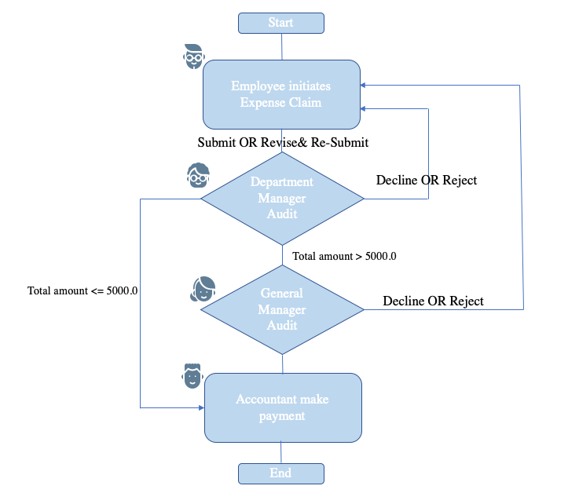
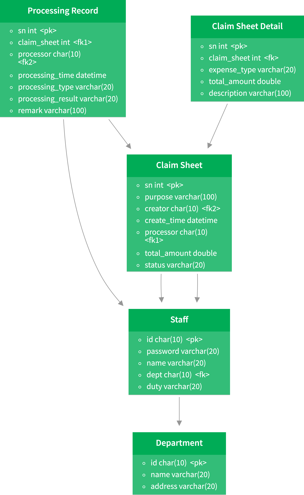
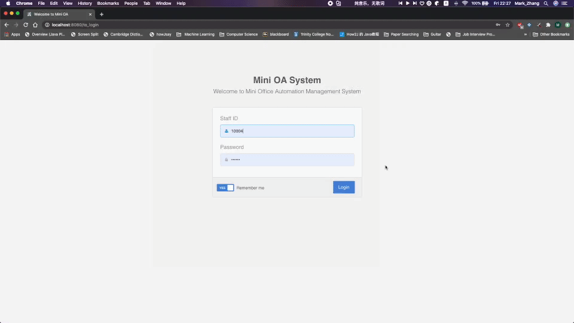
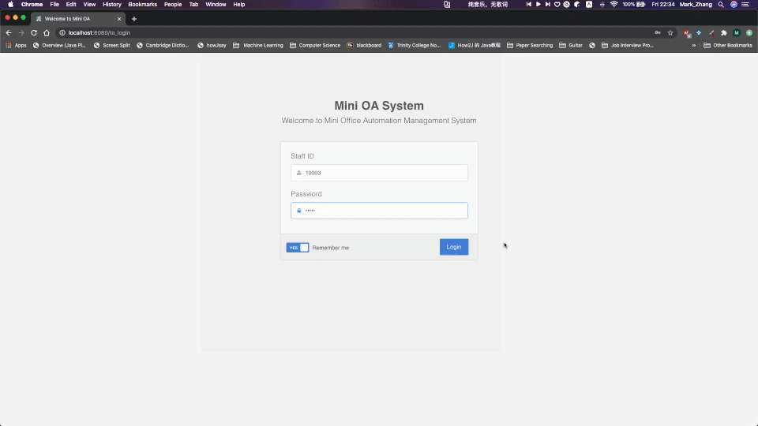
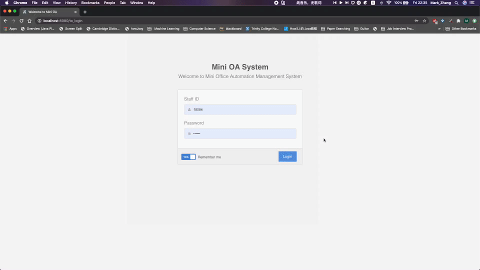

# Office-Automation-System
A basic expense claim system based on SSM (Spring + SpringMVC + Mybatis)

## Description
There are four basic roles in this system including general staff, department manager, accountant and general manager. Each role have the right to initiate a personal expense claim sheet. People with distinct duties would audit an application differently.

New department or staff can be added to the whole system.

## Processing Flow
The whole processing flow is described below.

    

## ERD Table

    

## Test Account
Four test account is provided:

|  ID   | Password  |  Duty  |
|  ----  | ----  | ----  |
| 10001  | 000 |  General Manager  |
| 10002  | 0000 |  Accountant  |
| 10003  | 00000  |  Dept Manager  |
| 10004  | 000000  | General Staff  |

## Functions

- Initiate an application
  

    

- Decline an application

    

- Revise & Re-submit

    

- Processing Flow

    

## Tech Stack
1. Java 8
2. SSM (Spring + SpringMVC + MyBatis)
3. BootStrap
4. JQuery
5. CSS3

## Tools
- [IntelliJ IDEA 2020.1](https://www.jetbrains.com/idea/)

